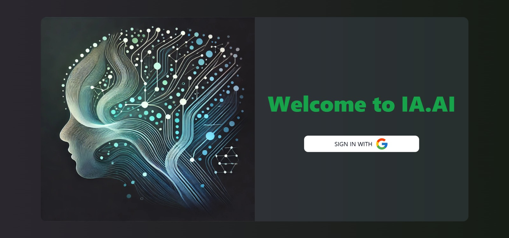
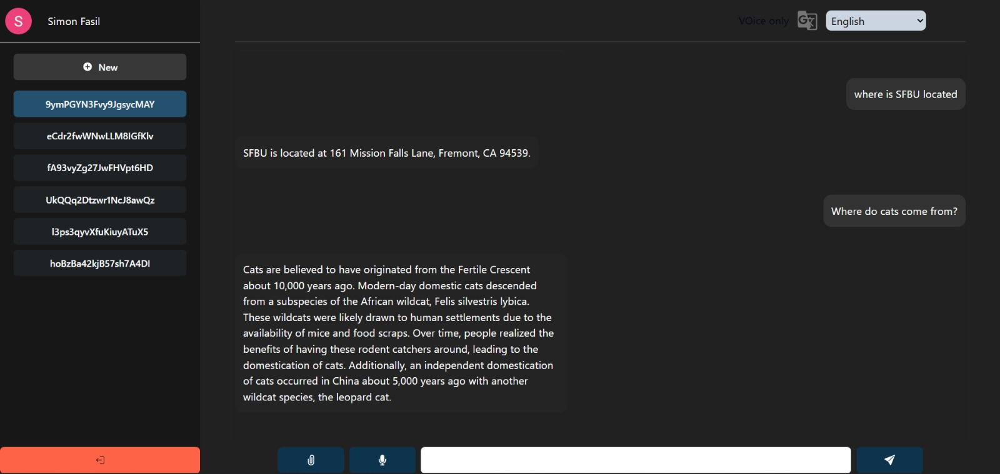
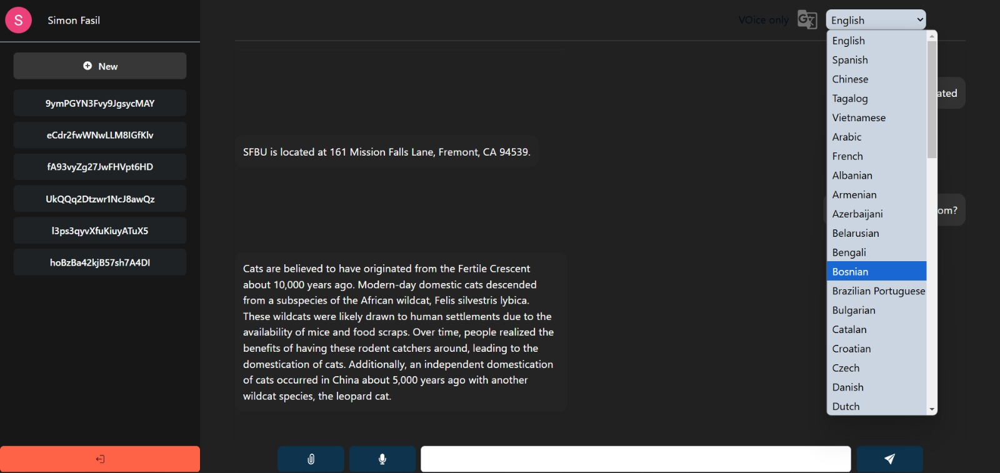
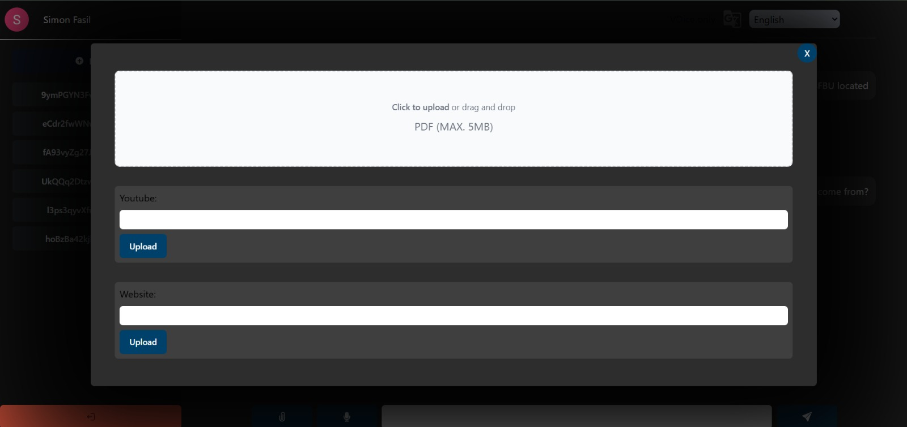
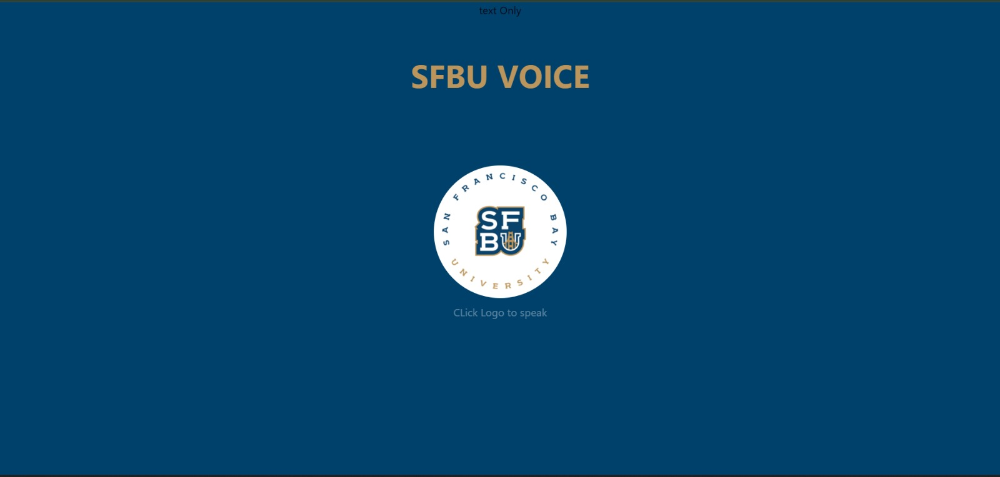

# _AI-Powered Multi-Modal Chatbot_

This project is a full-stack application combining an AI-powered chatbot with multi-modal input processing. The system integrates text, audio, and multimedia for dynamic user interaction, including document embedding, email composition, podcast generation, and real-time voice interaction.

---

# Google slides

https://docs.google.com/presentation/d/1457J8UuZK_4rIaUc9TDmMmy9AfC0gbl7UfGiwIxWpJU/edit?pli=1#slide=id.g32402de8a5c_2_75

### _Frontend Features_

- User authentication via Google Sign-In.
- Chatbot UI for real-time conversations.
- Multimedia upload support (PDFs, docs, spreadsheets, presentations, CSV, YouTube links, etc.).
- Interactive Dashboard with data visualization.
- Loading animations for smooth UX.
- User registration and login system.

### _Backend Features_

- Moderation system to detect and prevent harmful or malicious input.
- Multi-modal input handling:
  - Text processing.
  - Voice-to-text transcription with Whisper.
  - Embedding and semantic search for documents and multimedia.
- Podcast creation using Google Text-to-Speech.
- Email composition and sentiment analysis.
- Firebase integration for database storage.
- REST API endpoints for chatbot functionality, file uploads, and email services.

---

## _Project Structure_

### _Backend_

The backend is built with Flask, LangChain, and Firebase, handling AI models, data processing, and API endpoints.

_Key Files:_

- app.py: Main backend application.
- Moderations.py: Input moderation logic.
- podcaster.py: Podcast creation module.
- chromadab.py: Embedding and vector store management for various file formats.
- email_service.py: Email generation service.
- requirements.txt: Dependencies list.

### _Frontend_

The frontend is built with React, Vite, TailwindCSS, and Firebase.

_Key Files:_

- src/index.html: Entry point for the React application.
- src/App.jsx: Main application routing.
- src/components: Modular UI components for the chatbot, media selector, loading screens, etc.
- src/firebase_config.js: Firebase configuration.
- tailwind.config.js: TailwindCSS configuration.

---

## _Environment Setup_

### _Prerequisites_

- Python 3.10 or later
- Node.js 18 or later
- Firebase CLI
- Google Cloud Platform (GCP) credentials for Text-to-Speech API

### _Backend Environment_

1. _Clone the repository:_
   bash
   git clone <repository_url>
   cd <repository_folder>/backend

2. _Set up a Python virtual environment:_
   bash
   python -m venv venv
   source venv/bin/activate # On Windows, use venv\Scripts\activate

3. _Install dependencies:_
   bash
   pip install -r requirements.txt

4. _Add environment variables:_
   Create a .env file in the backend folder with the following keys:
   plaintext
   OPENAI_API_KEY=<Your OpenAI API Key>
   GOOGLE_APPLICATION_CREDENTIALS=<Path to your Google Cloud credentials JSON>
   appMAIL_SERVER=smtp.gmail.com
   appMAIL_PORT=587
   appMAIL_USE_TLS=True
   appMAIL_USERNAME=<Your Email>
   appMAIL_PASSWORD=<Your App Password>
   appMAIL_DEFAULT_SENDER=<Your Email>
   certificates=<Path to Firebase Admin SDK JSON>

5. _Run the backend server:_
   bash
   python app.py

---

### _Frontend Environment_

1. _Navigate to the frontend directory:_
   bash
   cd <repository_folder>/frontend

2. _Install dependencies:_
   bash
   npm install

3. _Add Firebase configuration:_
   Create a firebase_config.js file in the src directory:
   javascript
   import { initializeApp } from "firebase/app";
   import { getAuth, GoogleAuthProvider } from "firebase/auth";
   import { getFirestore } from "firebase/firestore";

   const firebaseConfig = {
   apiKey: "<Your API Key>",
   authDomain: "<Your Auth Domain>",
   projectId: "<Your Project ID>",
   storageBucket: "<Your Storage Bucket>",
   messagingSenderId: "<Your Messaging Sender ID>",
   appId: "<Your App ID>",
   };

   const app = initializeApp(firebaseConfig);
   const auth = getAuth(app);
   const db = getFirestore(app);
   const provider = new GoogleAuthProvider();

   export { auth, provider, db };

4. _Run the frontend server:_
   bash
   npm run dev

---

## _Usage_

1. _Start the Backend:_
   Ensure the backend server is running before starting the frontend:
   bash
   python app.py

2. _Start the Frontend:_
   Open another terminal and navigate to the frontend folder:
   bash
   npm run dev

3. _Access the Application:_
   Open your browser and navigate to:

   http://localhost:3000

---

## _Endpoints_

### _Backend API_

| Endpoint       | Method | Description                           |
| -------------- | ------ | ------------------------------------- |
| /ragEndpoint   | POST   | Handles user input for the chatbot.   |
| /load_db       | POST   | Uploads and embeds files.             |
| /load_web      | POST   | Processes and embeds web links.       |
| /load_youtube  | POST   | Processes YouTube links.              |
| /composeEmail  | POST   | Composes emails from drafts.          |
| /sendmail      | POST   | Sends emails to specified recipients. |
| /process_audio | POST   | Processes voice input and replies.    |
| /podcast       | POST   | Generates podcasts from queries.      |

---

## _Key Technologies_

### _Frontend_

- React
- TailwindCSS
- Firebase
- Vite

### _Backend_

- Python (Flask)
- LangChain
- Whisper AI
- Google Cloud Text-to-Speech
- Firebase Admin SDK

---

## _Screenshots_

## _Future Enhancements_

- Role-based authentication.
- Add dynamic language support for multiple locales.
- Enhance podcast features with personalized voice profiles.
- Expand multimedia embedding support.

---

## _Contributing_

1. Fork the repository.
2. Create a new branch (feature-branch).
3. Commit changes and push to the branch.
4. Open a pull request.

---
